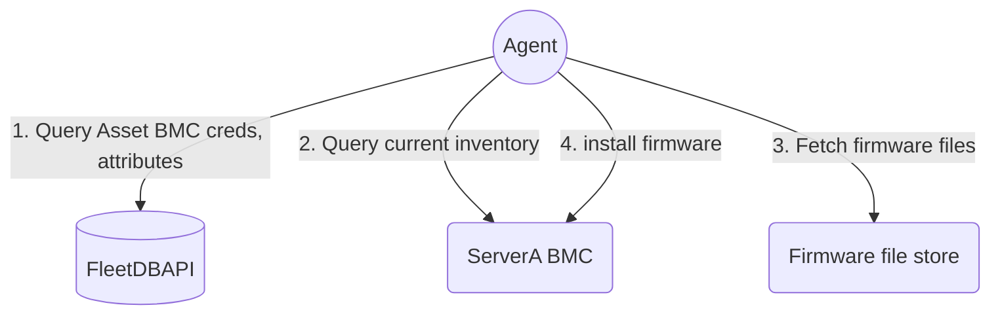

<pre>
 _______   _______   _______   __    _   _______ 
|   _   | |       | |       | |  |  | | |       |
|  |_|  | |    ___| |    ___| |   |_| | |_     _|
|       | |   | __  |   |___  |       |   |   |  
|       | |   ||  | |    ___| |  _    |   |   |  
|   _   | |   |_| | |   |___  | | |   |   |   |  
|__| |__| |_______| |_______| |_|  |__|   |___|  
</pre>

# Agent - server fleet automation service

Agent is a vendor agnostic service, cli to automate bare metal server actions across a server fleet.


Agent is currently supports installing firmware `Out of band` - through the host BMC,
and expects the host BMC to be reachable to install firmware.

If the given server is powered off, it will be powered on, the firmware will be install and  powered off after.

When a firmware requires the server to be power cycled, agent will perform
the power cycle action and poll until the firmware install is completed.

## Build

`make build-linux`

## Run

Agent can be run in the service mode or to one-shot cli install a given firmware file.

Note: it expects to be able to reach the BMC interface for the given server.

### service command

In the worker mode `agent worker`, agent depends on NATS to
accept work, a secret store for BMC secrets, a firmware file store for firmware files to install.

Check out the [sandbox](https://github.com/search?q=repo%3Ametal-automata%2Fsandbox%20agent&type=code) for steps to have it running along with its dependencies.

The [sandbox README.md](https://github.com/metal-automata/sandbox/blob/main/README.md) includes instructions to register a server, create firmware sets and install them on a server.

The diagram below depicts the services agent depends on:


### install command

The `agent install` command will install the given firmware file on a server,
and poll until the install is complete.


```sh
agent install --addr 192.168.1.1 \
                --user ADMIN \
                --pass hunder2 \
                --version 3.6 \
                --component bios \
                --vendor supermicro \
                --model x11dph-t \
                --force \
                --file /tmp/BIOS_X11DPH-0981_20220208_3.6_STD.bin \
                --dry-run  \
```


see [cheatsheet.md](./docs/cheatsheet.md)


### Supported devices

For out of band updates, Agent leverages [bmclib](https://github.com/bmc-toolbox/bmclib) and so supports firmware installs on devices that are supported by the library.

As of this writing, it supports Dell PowerEdge, Supermicro X11, X12, Asrockrack updates through their BMC.


### Documentation

Documentation on development and agent implementation can be found in [docs](./docs/README-devel.md)
